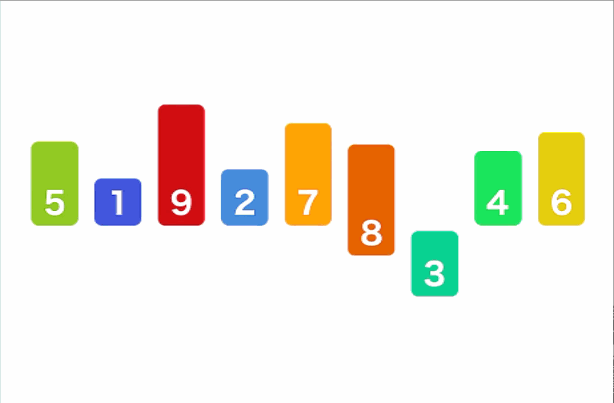
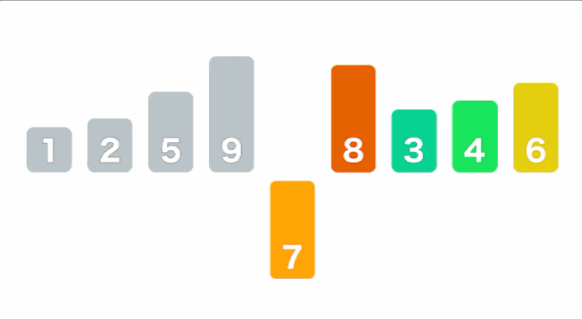

# 排序算法

1.  运行时间，性能
2.  额外的内存使用
    -   原地排序算法：除了函数调用所需的栈和固定数目的实例变量之外无需额外内存
    -   其他排序算法：需要额外内存空间来存储另一份数组副本
3.  接受任何可以比较的数据类型(泛型)


## 排序算法类模板

需要导入

```java
package Sort;

import java.util.Scanner;

/**
 *排序算法类的模板
 */
public class SortExample {
    public static void sort(Comparable[] a){
        //排序算法实现
    }

    public static boolean less(Comparable v, Comparable w){
        //对元素进行比较
        return v.compareTo(w)<0;
    }

    public static void exch(Comparable[] a,int i,int j){
        //交换元素
        Comparable t=a[i];
        a[i]=a[j];
        a[j]=t;
    }

    public static void show(Comparable[] a){
        //在单行中打印数组
        for(int i=0;i<a.length;i++){
            System.out.print(a[i]+"");
            System.out.println();
        }
    }

    public static boolean isSorted(Comparable[] a){
        //测试数组元素是否有序
        for(int i=1;i<a.length;i++){
            if(less(a[i],a[i-1])){
                return false;
            }
        }
        return true;
    }

    public static  void main(String[] args){
        Scanner scanner=new Scanner(System.in);
        while (scanner.hasNext()){
            String line=scanner.nextLine();
            String[] a=line.split(" ");
            sort(a);
            assert isSorted(a);
            show(a);
        }


    }
}
```


## 选择排序

>   不断选择剩余元素之中的最小者(最大者)
>
>   找到数组的最小(最大)的元素，与数组第一个元素交换位置，然后再剩下的部分中找到最小(最大)的元素，与数组的第二个元素交换，往复，直到数组末尾



```java

import static Sort.SortExample.*;

// 选择排序
public class SelectSort {
    public static void sort(Comparable[] a){

        int N = a.length;
        for(int i = 0; i < N; i ++){
            int min = i;
            for(int j = i+1; j < N; j++)
                if(less(a[j], a[min]))   // 当 a[j] < a[min]时，为true  所以为从小到大排列
                    min = j;
            exch(a, i, min);   // 在数组a中交换索引为 i min 的数据
        }
    }
}
```


### 特点

*   运行时间与输入无关
*   数据移动最少   N次交换

### 时间复杂度

$$
N^2/2
$$


## 插入排序

>   始终保持索引左边有序，新加入的元素不断向左移动，插入到左侧有序部分





```java
import static Sort.SortExample.*;

public class insertSort {
    public static void sort(Comparable[] b){

        int N = a.length;
        for(int i = 0; i < N; i ++){
            // 循环时要保证当前索引数据小于左边的数据  否则终止循环
            for(int j = i; j > 0 && less(a[j], a[j-1]); j --)
                exch(a, j, j-1);
        }
    }
}
```


## 希尔排序

>   经过优化的插入排序

对于大规模的乱序数组普通的插入排序很慢，因为它只会交换相邻的元素，元素只能一点一点地移动

优化后，希尔排序可以交换不相邻的元素以对数组的局部进行排序，并最终用插入排序将局部有序的小数组排序

步骤：

1.  将大数组分成多个小数组，每隔 h 个元素为一个小数组
2.  对每个小数组进行插入排序