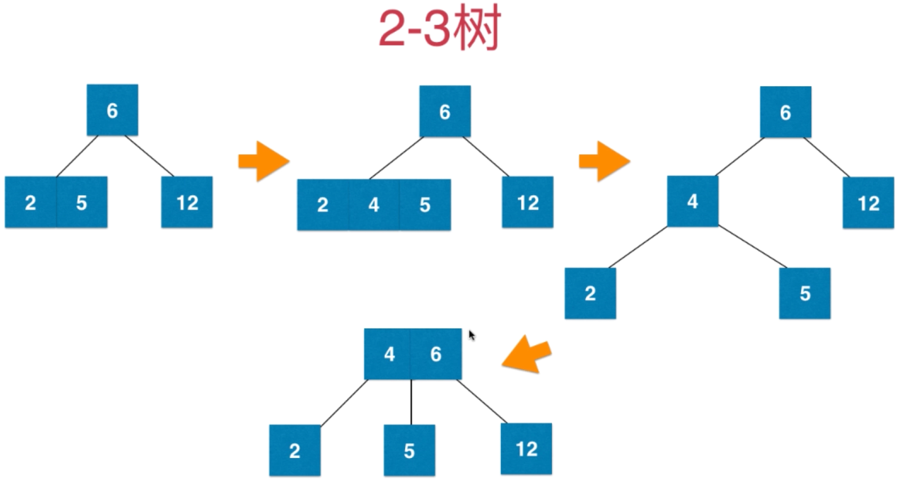
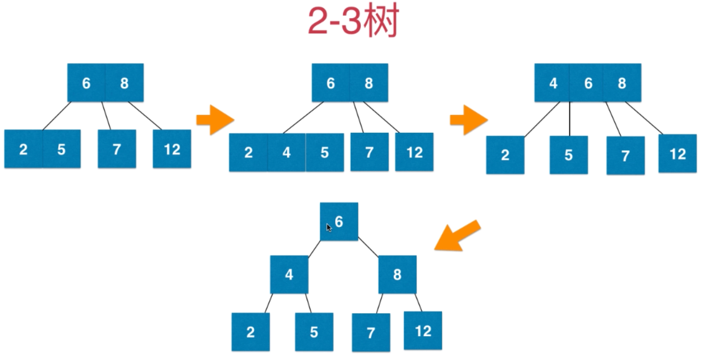
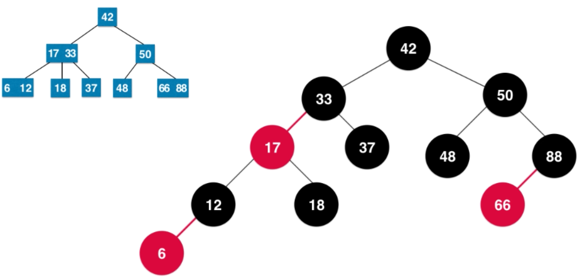
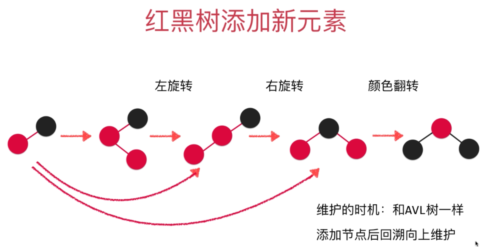
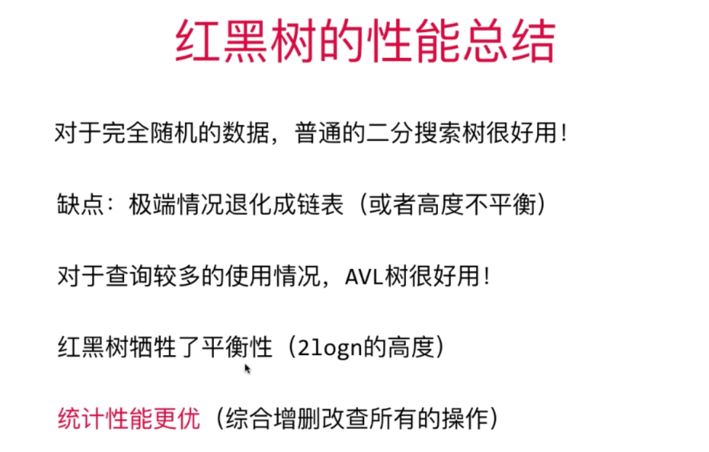

## 红黑树

>   是一种二分搜索树

### 红黑树与2 - 3 树的等价性

### 2--3树

>   **满足二分搜索树的性质**
>
>   **绝对平衡的树，任意节点的左右子树高度一定相同**
>
>   **节点可以存放一个元素或者两个元素**
>
>   **每个节点有 两个 或者 三个 孩子  称为2--3 树**
>
>   **有两个孩子的节点称为  2节点**
>
>   **有三个孩子的节点称为  3节点**

### 2--3树维持绝对平衡

#### 在添加操作中

-   永远添加到最后找到的叶子节点中，不会添加到空的位置上

-   当只有一个二节点时，添加一个元素，这个元素与根节点（也是最后的节点）融合，为一个三节点
-   当只有一个三节点时，添加元素，这个元素与根节点融合，成为一个四节点，随后，分成一颗高度为2，有一个根节点，两个左右孩子的2--3树（也是二分搜索树）

### 红黑树和2--3树

### 红黑树性质

>   **所有节点非红即黑**
>
>   **根节点为黑色**
>
>   **最后NULL节点为黑**
>
>   **红节点的孩子一定为黑**
>
>   **黑平衡**

-   保持“黑平衡”

-   不是平衡二叉树

-   最大高度为 h = 2log(n)     高度复杂度为 O(n)

-   增删改查复杂度为 O(logn)

### 添加元素

-   2--3树中添加一个新元素
-   或者添加进2-节点， 形成一个3- 节点
-   或者添加进 3- 节点， 暂时形成一个 4- 节点  然后不断向上融合 直到根节点为止
-   永远添加红色节点
-   保持根节点为黑色节点

1.  在添加节点时，若只有一个根节点，要添加的节点比根节点大，按照二分搜索树规律，应在根节点的右孩子位置，但此时不平衡，进行左旋转操作（与AVLTree的自平衡类似）
2.  向红黑树中的 3-- 节点添加元素，颜色翻转

3.  向一黑一红的树，添加元素，若为红节点的左节点，需要进行右旋转，使之平衡

### 性能分析

