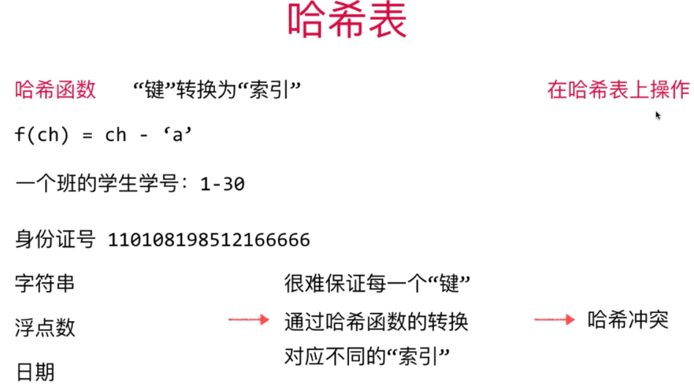
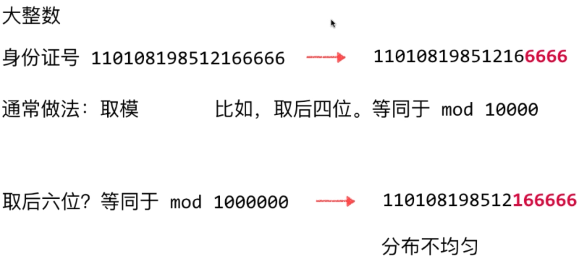
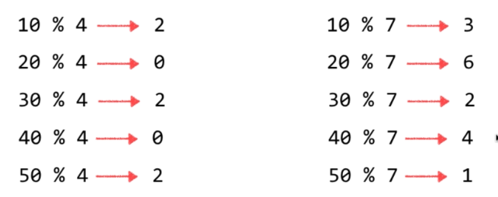
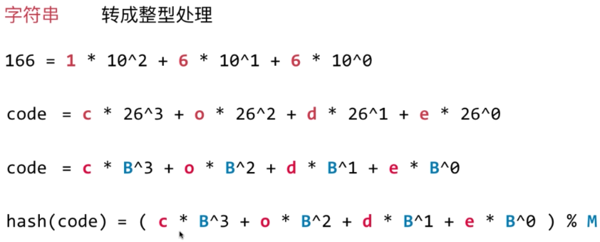
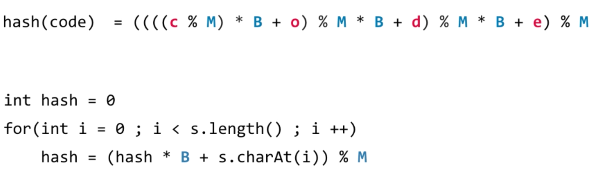
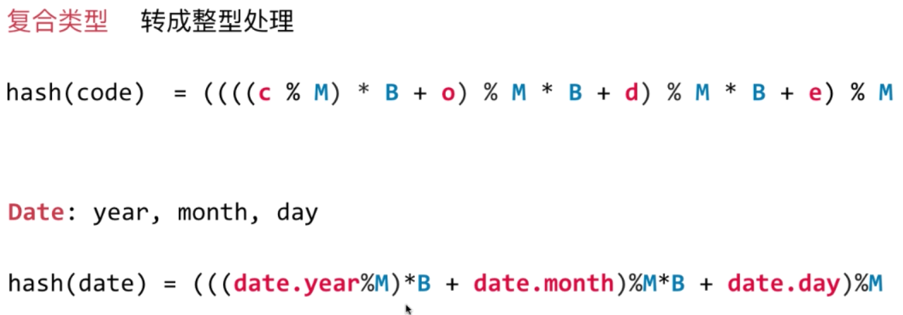
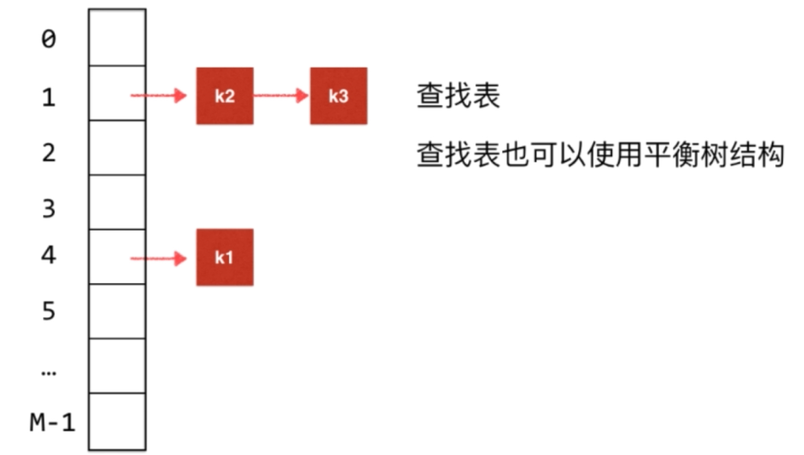
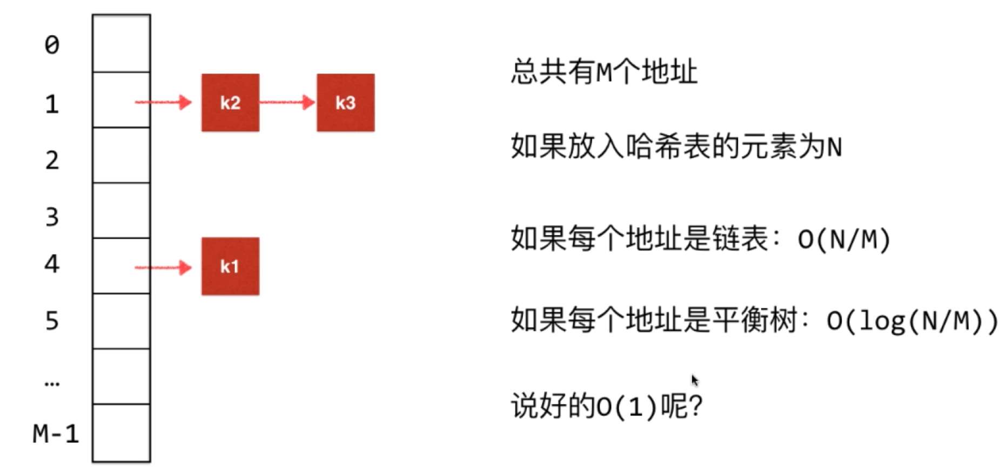

## 哈希表

>   每个字符都和索引相对应
>
>   字符与索引之间存在某种函数关系, 称为哈希函数
>
>   查找操作为 O(1)

### 用空间换时间

-   哈希表是时间与空间的平衡
-   哈希函数设计很重要
-   “键” 通过哈希函数得到的 “索引” 分布越均匀越好

### 哈希函数设计

>   哈希函数的一般设计原则

#### 整型

-   取后六位的mod 时， 存在陷阱，前两位是出生的日期，只可能咋1--31之间，出现了分布不均匀的情况， 也没有利用所有信息，增加了哈希冲突的几率
-   大整数解决方法： 模 一个 素数

图

#### 浮点型

#### 字符串

#### 复合类型

#### 函数设计原则

1.  一致性： 如果 a == b, 则 hash(a) == hash(b)
2.  高效性： 计算高效简便
3.  均匀性： 哈希值均匀分布

### 哈希冲突的处理   

### 链地址法

### 开放地址法

- 每个地址对于所有元素都开放
- 线性探测：产生哈希冲突时，元素添加到下一个未被占用的地址上
- 平方探测：产生哈希冲突时，元素添加到 +1，+4，+9，+16的平方地址上去

### 再哈希法

Rehashing