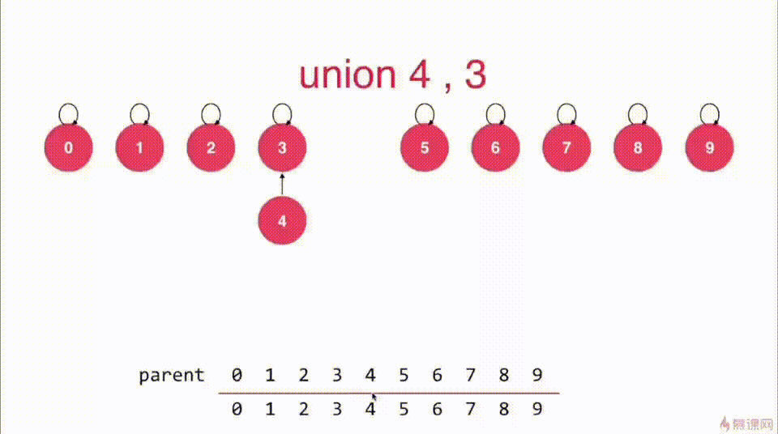
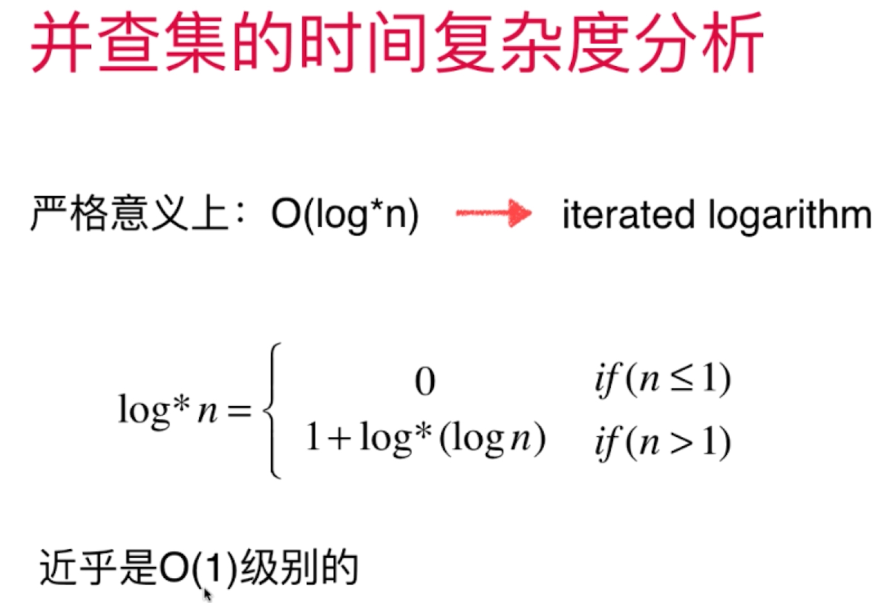
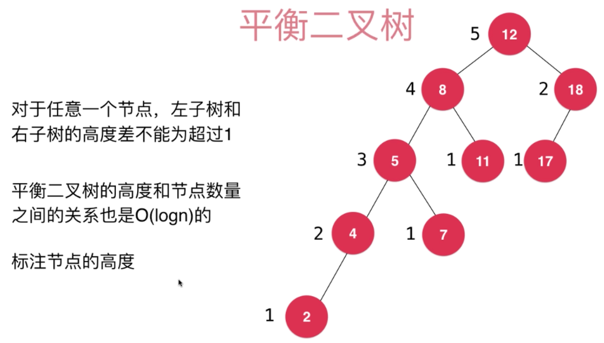

## 优先队列

-   普通队列： 先进先出，后进后出
-   优先队列： 出队顺序与入队顺序无关，与优先级有关
-   动态 ，  优先级不断变化, 按照一定规则来出队


### 通过堆来实现优先队列

#### 二叉堆

-   除了根节点，所有节点均小于等于父节点，又称最大堆（反之为最小堆）
-   一种完全二叉树，将元素一层层从左到右添加到树结构中


-   通过数组来表示二叉堆
-   索引从零开始


-   索引从一开始


##### sifi up

元素上浮操作，在插入元素时，先将新元素放于树的末端（数组的末尾），然后利用递归将其上调到合适的位置

##### sift  down

元素下沉操作，在删除最大元素时，先将根节点与末端交换，去掉交换后的末端，通过递归将此时的根节点的元素下沉

##### replace

取出堆中的最大元素，并且替换成元素e

##### heapify

-   将任意的数组整理成堆的形状
-   复杂度为O(n)

#### d 叉堆 d-ary heap


#### 索引堆

#### 斐波那契堆


## 线段树（区间树）

**Segment  Tree**


### 懒惰更新


### 树状数组

**Binary Index Tree**

### RMQ   

range minimum query


## Trie  字典树

图

Trie在进行查找操作时，与数据量无关，只与要查找的数据有关

### 前缀搜索

### Trie的 删除操作

### 局限性

```java
空间
class Node{
    boolean isWord;
    TreeMap<char, Node> next;
}    //对于存储26个字母来说，比字符串存储空间大了26倍
```

解决方法：


### 更多字符串问题

-   子串查询
-   文件压缩
-   模式匹配
-   编译原理
-   DNA RNA 


## 并查集

>   **Union Find**
>
>   连接问题，路径问题
>
>   网络中节点间的连接状态

对于一组数据，主要支持两个动作：

```
合并集合
union(p, q)
查询是否为同一集合
isConnected(p, q)
```

```
每个数据都有个ID值，相同ID值的数据在同一集合
将元素合并只需要将其的ID值改为
```

**通过树结构实现并查集，孩子指向父类的树**




### 优化

-   合并操作时，两个树的合并关系随机，为了保持高度最小，应在合并前判断，以节点数最小的数来依附节点数较大的数
-   实际上，在合并前判断，以高度来判断依托关系更佳


以节点数判断


以高度来判断


### 路径压缩

>   Path Compression


### 时间复杂度

**在进行路径压缩下**




## 平衡二叉树与AVL树

### 平衡二叉树

>   **对于任意一个节点，左子树和右子树的高度差不能超过1**




### 自平衡

>   在进行添加与删除操作时，会出现打破平衡

#### 右旋转 与 左旋转

**当发生左子树高度大于右子树高度，在左子树的左孩子位置添加元素时，进行右旋转，反之，进行左旋转**


```
进行右旋转操作
```


```
左旋转同理
```


```
当出现根节点的右子树的左子树出现不平衡时
先对左子树进行右旋转操作，将其变成 RR 型
反之同理
```


