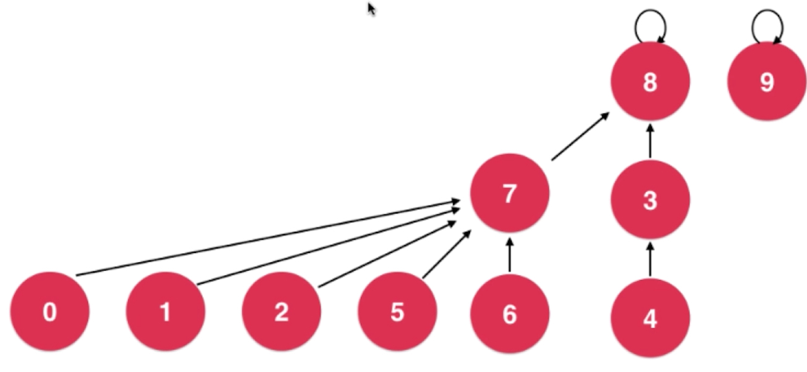

## Trie  字典树

图

Trie在进行查找操作时，与数据量无关，只与要查找的数据有关

### 前缀搜索

### Trie的 删除操作

### 局限性

```java
空间
class Node{
    boolean isWord;
    TreeMap<char, Node> next;
}    //对于存储26个字母来说，比字符串存储空间大了26倍
```

解决方法：


### 更多字符串问题

-   子串查询
-   文件压缩
-   模式匹配
-   编译原理
-   DNA RNA 


## 并查集

>   **Union Find**
>
>   连接问题，路径问题
>
>   网络中节点间的连接状态

对于一组数据，主要支持两个动作：

```
合并集合
union(p, q)
查询是否为同一集合
isConnected(p, q)
```

```
每个数据都有个ID值，相同ID值的数据在同一集合
将元素合并只需要将其的ID值改为
```

**通过树结构实现并查集，孩子指向父类的树**


### 优化

-   合并操作时，两个树的合并关系随机，为了保持高度最小，应在合并前判断，以节点数最小的数来依附节点数较大的数
-   实际上，在合并前判断，以高度来判断依托关系更佳


以节点数判断


以高度来判断




### 路径压缩

>   Path Compression


### 时间复杂度

**在进行路径压缩下**

