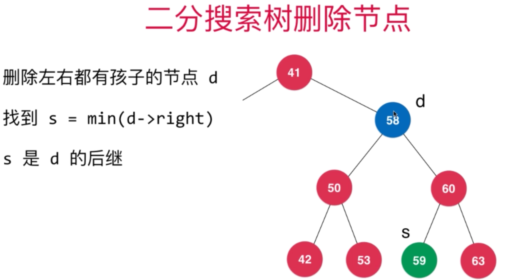

# @树结构

## 二叉树

-   动态数据结构
-   唯一根节点，每个节点最多两个孩子，末端为叶子节点（无孩子）
-   每个节点最多一个父亲
-   具有天然的递归结构
-   不一定为满二叉（每个节点都有两个孩子）

### 满二叉树

>   除了叶子节点外，每个节点都有左右两个子树

### 完全二叉树

>   将数据按照二叉树的形状一层一层从左到右加入树中

## 二分搜索树

>   Binary Search  Tree
>
>   高效  存储数据高效
>
>   每个节点的值，比左边大，比右边小
>
>   存储的元素必须有可比较性
>
>   不包含重复元素

**Blinary_Search_tree包**

### 顺序性

后继      前序

successor, predecessor

-   floor   比确定值小的元素中最大的那个
-   ceil      比确定值大的元素最小的那个
-   rank      确定值的排名
-   select    确定排名的值
-   维护size     每个节点以自身为根节点的树有几个节点（包括自身）

