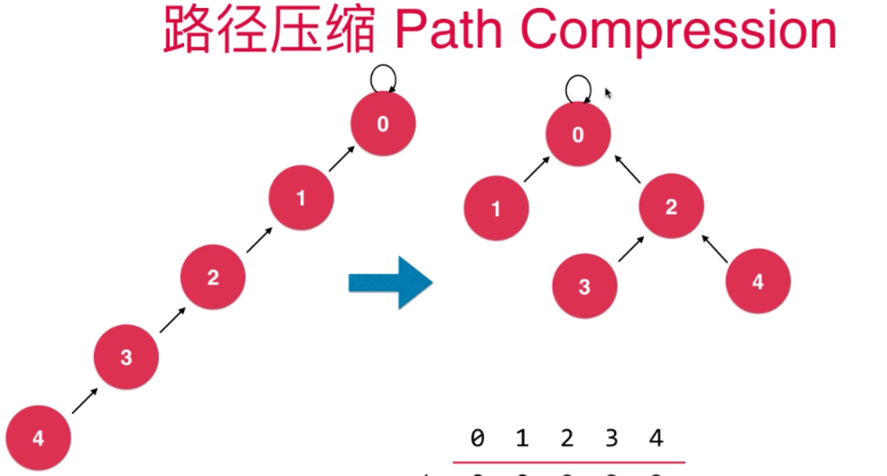
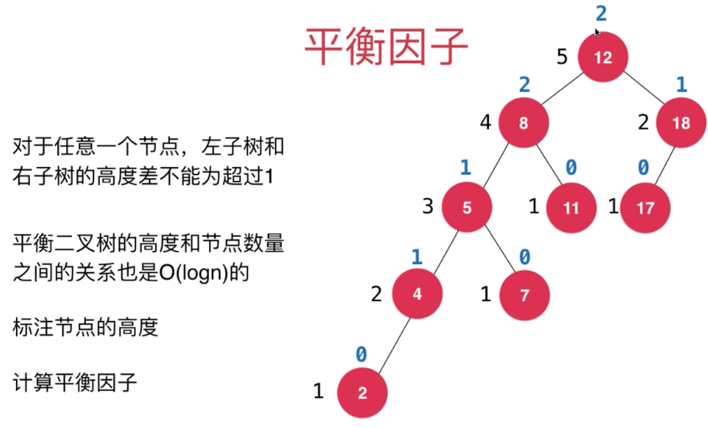
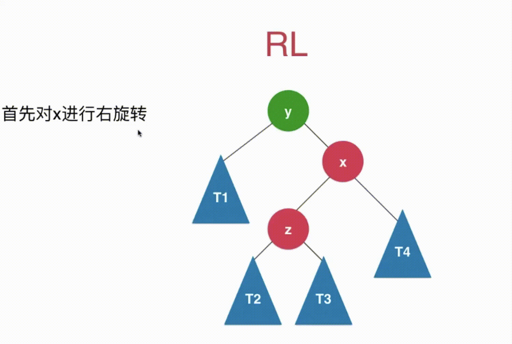

## 并查集

>   **Union Find**
>
>   连接问题，路径问题
>
>   网络中节点间的连接状态

对于一组数据，主要支持两个动作：

```
合并集合
union(p, q)
查询是否为同一集合
isConnected(p, q)
```

```
每个数据都有个ID值，相同ID值的数据在同一集合
将元素合并只需要将其的ID值改为
```

**通过树结构实现并查集，孩子指向父类的树**


### 优化

-   合并操作时，两个树的合并关系随机，为了保持高度最小，应在合并前判断，以节点数最小的数来依附节点数较大的数
-   实际上，在合并前判断，以高度来判断依托关系更佳


以节点数判断


以高度来判断


### 路径压缩

>   Path Compression





### 时间复杂度

**在进行路径压缩下**


## 平衡二叉树与AVL树

### 平衡二叉树

>   **对于任意一个节点，左子树和右子树的高度差不能超过1**




### 自平衡

>   在进行添加与删除操作时，会出现打破平衡

#### 右旋转 与 左旋转

**当发生左子树高度大于右子树高度，在左子树的左孩子位置添加元素时，进行右旋转，反之，进行左旋转**


```
进行右旋转操作
```


```
左旋转同理
```


```
当出现根节点的右子树的左子树出现不平衡时
先对左子树进行右旋转操作，将其变成 RR 型
反之同理
```



